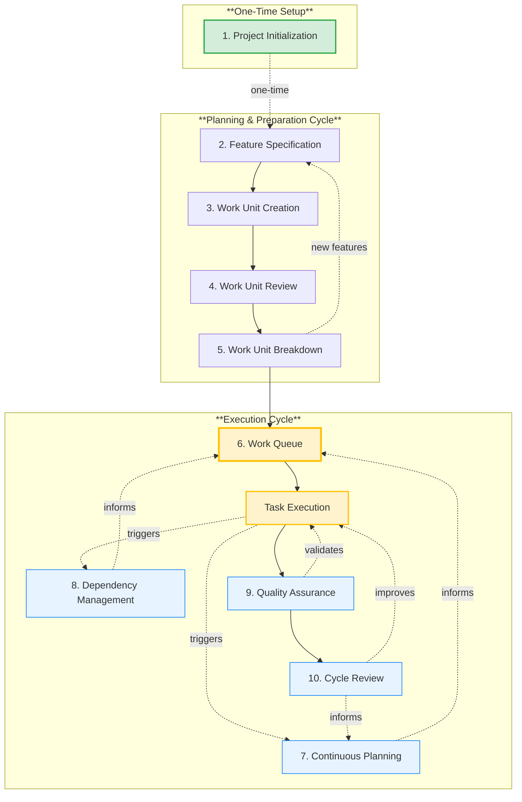

# RHYTHM Method Workflows

**Version:** 1.0.0  
**Last Updated:** 2025-11-22  
**Status:** Initial Draft - For Review

## Overview

RHYTHM Method workflows are designed for **agents with human integration**. Workflows leverage agent capabilities (speed, precision, automation) while maintaining essential human oversight and strategic control.

## Core Workflows

The following diagram illustrates how RHYTHM Method workflows connect and flow together:

> **Note:** Project Initialization (step 1) is a one-time setup that occurs only once at the beginning of a project. All other workflows are ongoing and repeat as needed throughout the project lifecycle.

### 1. Project Initialization

**Purpose:** Establish the foundation for RHYTHM Method in a project.

**Process:**

1. **Create [Project Manifest](1-dictionary.md#project-manifest)**

   - Single source of truth for project requirements
   - Project information repository
   - Decision log for architectural decisions and requirement changes
   - Human validation required

2. **Configure RHYTHM Settings**

   - [TEMPO](1-dictionary.md#tempo) settings (High, Moderate, Controlled)
   - [HITL](1-dictionary.md#human-in-the-loop-hitl) gate configuration
   - Agent capacity and specialization
   - Quality gate thresholds

   > **Note:** Additional RHYTHM Method configurations will be documented as we work through the actual process implementation.

3. **Initialize Work Queue**

   - Set up dependency tracking
   - Configure prioritization rules
   - Establish validation criteria

**Human Involvement:**

- Validate [Project Manifest](1-dictionary.md#project-manifest)
- Approve RHYTHM configuration
- Provide strategic guidance

**Agent Involvement:**

- Generate [Project Manifest](1-dictionary.md#project-manifest) template
- Analyze project structure and [dependencies](1-dictionary.md#dependency)
- Set up automated workflows

### 2. [Feature](1-dictionary.md#feature) Specification

**Purpose:** Create detailed specifications for features before implementation.

**Process:**

1. **Feature Definition**

   - Business value and objectives
   - User requirements and validation criteria
   - Technical constraints and interfaces
   - Human validation required

2. **[Dependency](1-dictionary.md#dependency) Analysis**

   - Automated dependency detection
   - [Dependency graph](1-dictionary.md#dependency-graph) updates
   - Impact analysis
   - Human review of critical dependencies

3. **[Specification](1-dictionary.md#specification) Creation**

   - Detailed, structured specification document
   - Machine-readable format (YAML/JSON)
   - Validation criteria definition
   - Human approval required

**Human Involvement:**

- Define business requirements
- Validate specifications
- Approve feature scope
- Review critical dependencies

**Agent Involvement:**

- Analyze requirements
- Detect dependencies automatically
- Generate specification documents
- Validate specification completeness

### 3. [Work Unit](1-dictionary.md#work-unit) Creation

**Purpose:** Break down features into executable work units.

**Process:**

1. **[Feature](1-dictionary.md#feature) Breakdown**

   - Analyze feature [specification](1-dictionary.md#specification)
   - Identify [work unit](1-dictionary.md#work-unit) boundaries
   - Define work unit [dependencies](1-dictionary.md#dependency)
   - Human validation of breakdown

2. **[Work Unit](1-dictionary.md#work-unit) Specification**

   - Detailed work unit requirements
   - [Agent Task](1-dictionary.md#agent-task) identification
   - Agent assignment planning
   - [Token estimation](1-dictionary.md#token-estimation)

3. **[Work Unit](1-dictionary.md#work-unit) Assignment**

   - Add to prioritized work queue
   - [Dependency-driven prioritization](1-dictionary.md#dependency-driven-prioritization)
   - Agent capacity allocation
   - Human approval for high-priority work

**Human Involvement:**

- Validate work unit breakdown
- Approve work unit priorities
- Review agent assignments

**Agent Involvement:**

- Analyze [feature](1-dictionary.md#feature) [specifications](1-dictionary.md#specification)
- Create [work unit](1-dictionary.md#work-unit) breakdown
- Estimate [tokens](1-dictionary.md#token)
- Update [dependency graph](1-dictionary.md#dependency-graph)

### 4. [Work Unit](1-dictionary.md#work-unit) Review

**Purpose:** Review and refine Features and Work Units created by Users and the RHYTHM Agent, providing feedback, challenges, and acceptance before proceeding to breakdown.

**Process:**

1. **Work Unit Review**

   - Agents review [Feature](1-dictionary.md#feature) and [Work Unit](1-dictionary.md#work-unit) specifications
   - Provide feedback on clarity, completeness, and feasibility
   - Challenge assumptions and identify potential issues
   - Suggest improvements or clarifications
   - Human review of agent feedback

2. **Review Resolution**

   - Address agent feedback and challenges
   - Update specifications based on review
   - Resolve conflicts or ambiguities
   - Human approval of resolved items

3. **Review Acceptance**

   - Final validation of reviewed items
   - Approval from all stakeholders
   - Mark items as ready for breakdown
   - Human sign-off required

**Human Involvement:**

- Review agent feedback and challenges
- Resolve conflicts and ambiguities
- Approve updated specifications
- Provide final sign-off for reviewed items

**Agent Involvement:**

- Review Feature and Work Unit specifications
- Provide feedback and challenges
- Identify potential issues or improvements
- Validate specification completeness

> **Note:** This workflow is similar to backlog refinement in traditional methodologies, but adapted for agentic review and human validation.

### 5. [Work Unit](1-dictionary.md#work-unit) Breakdown

**Purpose:** Break down approved Work Units into executable Agent Tasks after Work Unit Review is complete.

**Process:**

1. **Task Identification**

   - Analyze approved [Work Unit](1-dictionary.md#work-unit) specification
   - Identify required [Agent Tasks](1-dictionary.md#agent-task)
   - Determine task dependencies
   - Estimate task complexity and [token](1-dictionary.md#token) requirements
   - Human validation of task breakdown

2. **Task Specification**

   - Create detailed [Agent Task](1-dictionary.md#agent-task) specifications
   - Define task acceptance criteria
   - Assign tasks to specialized agents
   - Set task priorities within Work Unit
   - Human approval of task assignments

3. **Task Readiness**

   - Validate all tasks are properly specified
   - Ensure dependencies are identified
   - Confirm agent assignments are appropriate
   - Mark tasks as ready for execution
   - Human approval for task readiness

**Human Involvement:**

- Validate task breakdown
- Approve task specifications
- Review and approve agent assignments
- Provide final approval for task readiness

**Agent Involvement:**

- Analyze Work Unit specifications
- Create Agent Task breakdown
- Identify task dependencies
- Estimate [token](1-dictionary.md#token) requirements
- Assign tasks to appropriate specialized agents

### 6. Work Queue

**Purpose:** Maintain a prioritized queue of ready [Agent Tasks](1-dictionary.md#agent-task) waiting for execution.

**Process:**

1. **Queue Management**

   - Receive [Agent Tasks](1-dictionary.md#agent-task) from [Work Unit Breakdown](#5-work-unit-breakdown)
   - Apply [dependency-driven prioritization](1-dictionary.md#dependency-driven-prioritization)
   - Order tasks by [dependency](1-dictionary.md#dependency) resolution status
   - Maintain real-time queue status

2. **Task Readiness Validation**

   - Verify all [dependencies](1-dictionary.md#dependency) are resolved
   - Confirm task specifications are complete
   - Check agent capacity availability
   - Human approval for high-priority items

3. **Queue Updates**

   - Real-time updates from [Continuous Planning](#7-continuous-planning)
   - [Dependency Management](#8-dependency-management) reordering
   - Priority adjustments based on business value
   - Human visibility and control

**Human Involvement:**

- Review queue priorities
- Approve high-priority task execution
- Override prioritization when needed
- Strategic queue management

**Agent Involvement:**

- Automatically maintain queue order
- Update priorities based on [dependency](1-dictionary.md#dependency) changes
- Real-time queue status reporting
- Capacity-aware queue management

### Task Execution

**Purpose:** Execute [Agent Tasks](1-dictionary.md#agent-task) pulled from the [Work Queue](#6-work-queue), performing the actual development work in focused [execution cycles](1-dictionary.md#execution-cycle) (2-8 hours).

**Process:**

1. **Task Pulling**

   - Pull ready [Agent Tasks](1-dictionary.md#agent-task) from [Work Queue](#6-work-queue)
   - Verify [dependencies](1-dictionary.md#dependency) are resolved
   - Allocate specialized agents
   - Human approval for cycle scope

2. **Parallel Task Execution**

   - Specialized agents execute assigned tasks
   - Parallel execution across multiple agents
   - Real-time status updates
   - Automated [dependency](1-dictionary.md#dependency) resolution during execution

3. **Execution Monitoring**

   - Real-time progress tracking
   - Automated status reporting
   - Blocked task detection
   - Human visibility through dashboards

**Human Involvement:**

- Approve execution cycle scope
- Monitor execution progress
- Resolve blockers when needed
- Strategic guidance

**Agent Involvement:**

- Execute tasks at fast [TEMPO](1-dictionary.md#tempo)
- Coordinate multi-agent work
- Automated task execution
- Real-time status reporting

> **Note:** Task Execution is part of the Execution Cycle workflow. After tasks are executed, they flow through [Quality Assurance](#9-quality-assurance) for validation and [Cycle Review](#10-cycle-review) for process improvement. Task Execution also triggers [Continuous Planning](#7-continuous-planning) and [Dependency Management](#8-dependency-management) to keep the system synchronized.

### 7. [Continuous Planning](1-dictionary.md#continuous-planning)

**Purpose:** Maintain up-to-date plans based on real-time information.

**Process:**

1. **Real-Time Plan Updates**

   - Automatic plan updates as work progresses
   - [Dependency graph](1-dictionary.md#dependency-graph) changes
   - Priority adjustments
   - Capacity reallocation

2. **[Dynamic Replanning](1-dictionary.md#dynamic-replanning)**

   - Instant replanning when priorities change
   - [Dependency](1-dictionary.md#dependency) resolution updates
   - Work queue reordering
   - Human notification of major changes

3. **Capacity Planning**

   - [Token](1-dictionary.md#token)-based capacity calculation
   - Agent [throughput rate](1-dictionary.md#token-throughput-rate) analysis
   - Work queue prioritization
   - Human review of capacity plans

**Human Involvement:**

- Review major plan changes
- Approve priority adjustments
- Strategic guidance

**Agent Involvement:**

- Automated plan updates
- [Dependency](1-dictionary.md#dependency) analysis
- Capacity calculations
- Real-time replanning

### 8. [Dependency](1-dictionary.md#dependency) Management

**Purpose:** Manage dependencies automatically with human oversight.

**Process:**

1. **[Dependency](1-dictionary.md#dependency) Detection**

   - Automated dependency analysis
   - Technical, data, integration, knowledge dependencies
   - [Dependency graph](1-dictionary.md#dependency-graph) maintenance
   - Human review of critical dependencies

2. **[Dependency](1-dictionary.md#dependency) Resolution**

   - [Dependency-driven prioritization](1-dictionary.md#dependency-driven-prioritization)
   - Work queue ordering
   - Parallel execution where possible
   - Human approval for dependency overrides

3. **[Dependency](1-dictionary.md#dependency) Tracking**

   - Real-time [dependency graph](1-dictionary.md#dependency-graph)
   - Critical path identification
   - Blocked work detection
   - Human visibility and alerts

**Human Involvement:**

- Review critical dependencies
- Approve dependency overrides
- Strategic dependency decisions

**Agent Involvement:**

- Automated [dependency](1-dictionary.md#dependency) detection
- [Dependency graph](1-dictionary.md#dependency-graph) maintenance
- Prioritization automation
- Real-time tracking

### 9. Quality Assurance

**Purpose:** Ensure quality through automated gates and [HITL](1-dictionary.md#human-in-the-loop-hitl) checkpoints.

**Process:**

1. **Automated [Quality Gates](1-dictionary.md#quality-gate)**

   - Code quality checks
   - Automated testing
   - Performance validation
   - Security scanning

2. **[HITL](1-dictionary.md#human-in-the-loop-hitl) Checkpoints**

   - Human review at critical milestones
   - [Specification](1-dictionary.md#specification) validation
   - Deployment approval
   - Strategic decision points

3. **Continuous Validation**

   - Real-time quality monitoring
   - Automated test execution
   - Validation against [specifications](1-dictionary.md#specification)
   - Quality metrics tracking

**Human Involvement:**

- Review [quality gate](1-dictionary.md#quality-gate) results
- Approve deployments
- Strategic quality decisions

**Agent Involvement:**

- Automated quality checks
- Test execution
- Quality metrics collection
- Real-time reporting

### 10. Cycle Review

**Purpose:** Analyze [execution cycles](1-dictionary.md#execution-cycle) and improve the process.

**Process:**

1. **Automated Analysis**

   - Cycle performance metrics
   - [Token estimation](1-dictionary.md#token-estimation) accuracy
   - [Dependency](1-dictionary.md#dependency) resolution effectiveness
   - [Quality gate](1-dictionary.md#quality-gate) results

2. **Process Improvement**

   - Identify improvement opportunities
   - Suggest workflow optimizations
   - Update estimation models
   - Refine quality gates

3. **Learning Integration**

   - Update methodology based on learnings
   - Improve agent coordination
   - Optimize [HITL](1-dictionary.md#human-in-the-loop-hitl) checkpoints
   - Enhance [dependency](1-dictionary.md#dependency) management

**Human Involvement:**

- Review cycle analysis
- Approve process improvements
- Strategic methodology decisions

**Agent Involvement:**

- Automated cycle analysis
- Process improvement suggestions
- Methodology refinement
- Learning integration

> **Note:** Workflows embody the six core principles of RHYTHM Method (TEMPO, Flow, Control, Coordination, Precision, Adaptive). See [2. Principles](2-principles.md) for detailed explanations of these principles.

## Workflow Integration

### Workflows Work Together

RHYTHM Method workflows are integrated:

- **[Project Initialization](#1-project-initialization)** → Sets up all workflows
- **[Feature Specification](#2-feature-specification)** → Feeds into [Work Unit Creation](#3-work-unit-creation)
- **[Work Unit Creation](#3-work-unit-creation)** → Feeds into [Work Unit Review](#4-work-unit-review)
- **[Work Unit Review](#4-work-unit-review)** → Feeds into [Work Unit Breakdown](#5-work-unit-breakdown)
- **[Work Unit Breakdown](#5-work-unit-breakdown)** → Feeds into [Work Queue](#6-work-queue)
- **[Work Queue](#6-work-queue)** → Feeds into Task Execution
- **Task Execution** → Feeds into [Quality Assurance](#9-quality-assurance)
- **[Quality Assurance](#9-quality-assurance)** → Feeds into [Cycle Review](#10-cycle-review)
- **Task Execution** → Triggers [Continuous Planning](#7-continuous-planning) and [Dependency Management](#8-dependency-management)
- **[Continuous Planning](#7-continuous-planning)** → Informs [Work Queue](#6-work-queue)
- **[Dependency Management](#8-dependency-management)** → Informs [Work Queue](#6-work-queue)
- **[Quality Assurance](#9-quality-assurance)** → Validates Task Execution
- **[Cycle Review](#10-cycle-review)** → Improves Task Execution and all workflows

### Continuous Improvement

Workflows improve over time:

- Cycle Review analyzes workflow effectiveness
- Process improvements are integrated automatically
- Methodology evolves based on learnings
- Human feedback enhances workflows

## Summary

RHYTHM Method workflows are designed for agents with human integration, enabling agents to operate at their full potential (fast TEMPO) while ensuring humans maintain strategic control and oversight (RHYTHM). The core workflows include one-time setup (Project Initialization), planning and preparation cycles (Feature Specification, Work Unit Creation, Work Unit Review, Work Unit Breakdown), and execution cycles (Work Queue, Task Execution, Continuous Planning, Dependency Management, Quality Assurance, Cycle Review). These workflows work together in an integrated system that supports continuous execution, dependency-driven prioritization, and human-in-the-loop checkpoints.

---

## Navigation

**Previous:** [3. TEMPO](3-tempo.md) - Understanding TEMPO: the speed/pace at which agents operate

---

## Change History

| Version | Date       | Author  | Description                   |
| ------- | ---------- | ------- | ----------------------------- |
| 1.0.0   | 2025-11-22 | Initial | Initial RHYTHM workflows docs |
